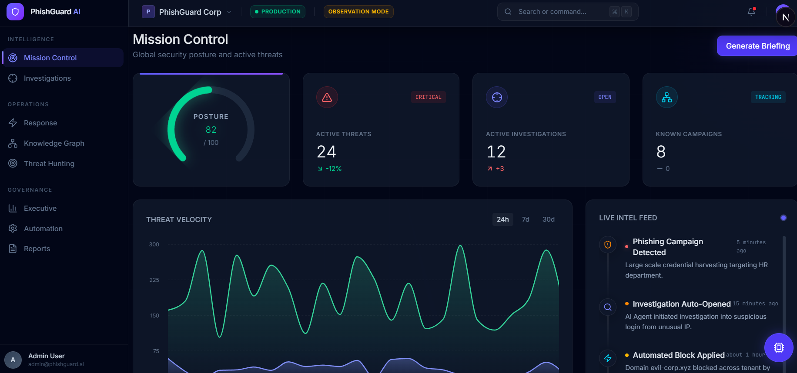
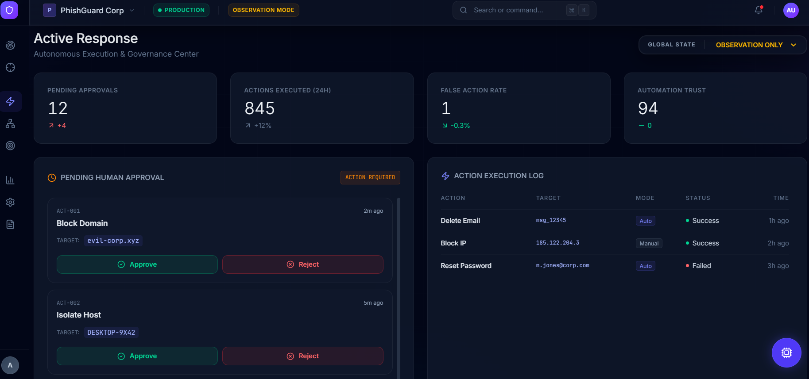
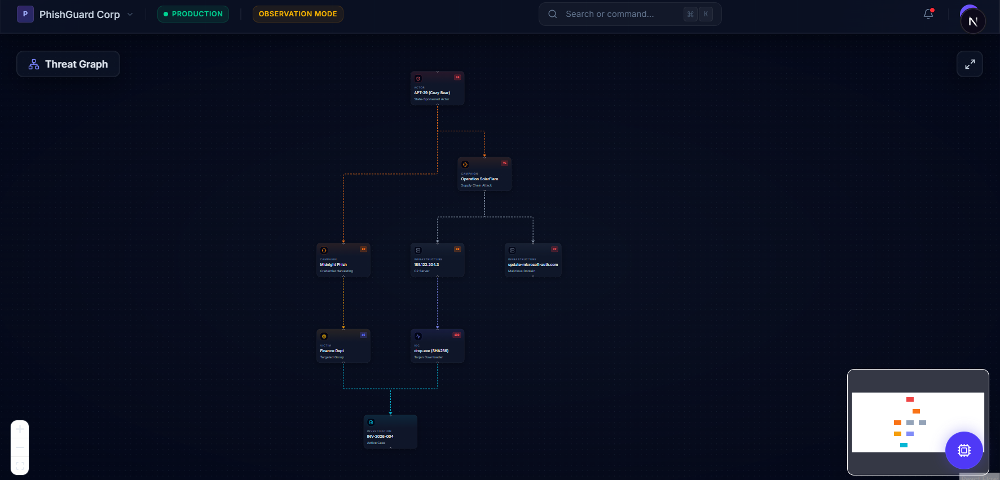
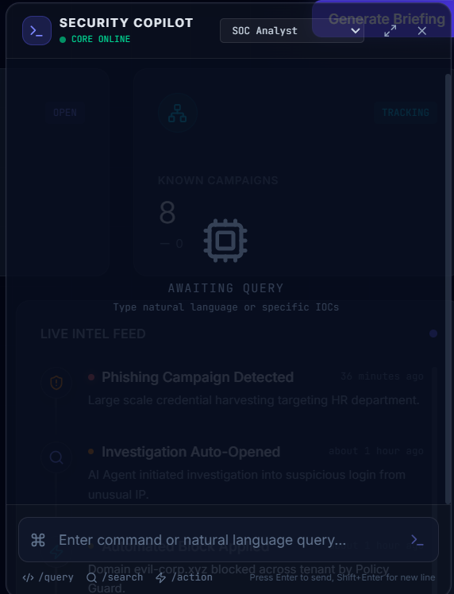
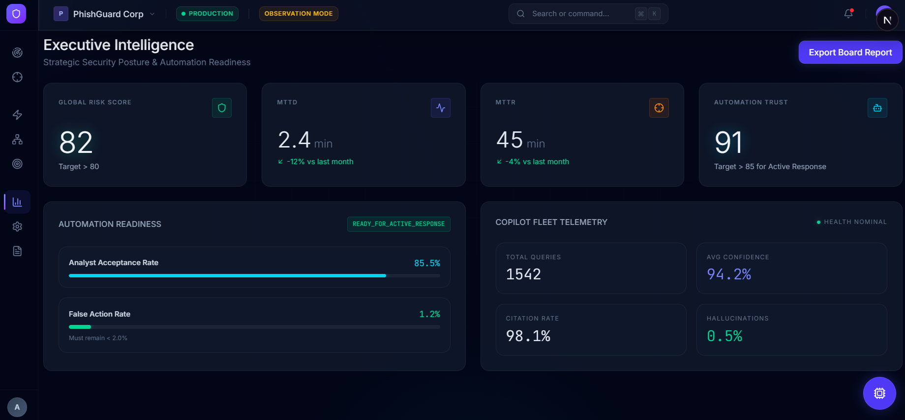
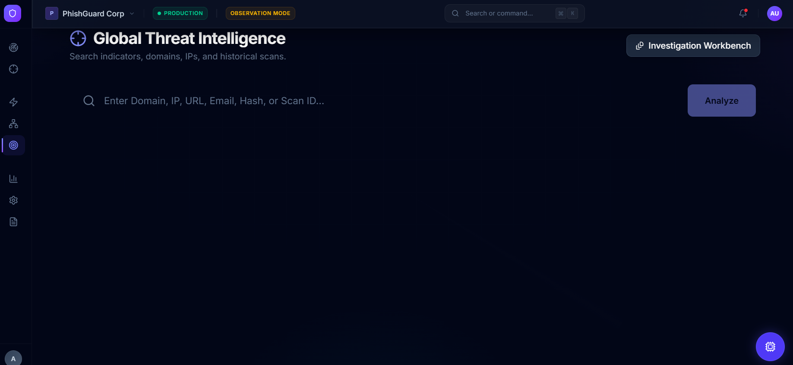

<p align="center">
  <h1 align="center">🛡️ PhishGuard AI</h1>
  <p align="center">
    <strong>AI-Powered Email Threat Intelligence & Investigation Platform</strong>
  </p>
  <p align="center">
    Enterprise-grade phishing detection • Multi-agent AI analysis • Real-time threat intelligence
  </p>
</p>

---

<p align="center">
  
</p>

## Overview

PhishGuard AI is a production-grade cybersecurity SaaS platform that detects phishing, business email compromise (BEC), spoofing attacks, malicious URLs, credential theft attempts, malware delivery, and social engineering attacks using a hybrid AI + threat intelligence architecture.

### Key Capabilities

- **Multi-Agent Threat Analysis** — Specialized AI agents (Header, URL, Attachment, Social Engineering, Correlation, Incident Response) perform independent analysis orchestrated by a central engine
- **Explainable AI** — Every detection includes evidence, reasoning, and confidence scores
- **Security Knowledge Graph** — Interactive graph visualization connecting emails, domains, senders, URLs, campaigns, and threat actors
- **Autonomous Investigation** — Automated SOC-style investigation with full report generation
- **Real-Time Monitoring** — WebSocket-powered live scan updates and threat feeds
- **Threat Intelligence Correlation** — Identify recurring campaigns, attacker infrastructure reuse, and threat clusters
- **AI Security Copilot** — Chat with analyzed emails to understand threats and get incident response guidance

## Architecture

```
┌─────────────────┐     ┌──────────────────┐     ┌─────────────────┐
│   Next.js UI    │────▶│  FastAPI Server   │────▶│   PostgreSQL    │
│   (Port 3000)   │     │   (Port 8000)     │     │   (Port 5432)   │
└─────────────────┘     └──────────────────┘     └─────────────────┘
                              │       │
                              │       │
                        ┌─────▼───┐   │
                        │  Redis  │   │
                        │ (6379)  │   │
                        └─────────┘   │
                              │       │
                    ┌─────────▼───────▼──────────┐
                    │     Celery Workers          │
                    │  ┌─────────────────────┐    │
                    │  │ Multi-Agent Engine   │    │
                    │  │ ┌───┐ ┌───┐ ┌───┐   │    │
                    │  │ │HDR│ │URL│ │ATT│   │    │
                    │  │ └───┘ └───┘ └───┘   │    │
                    │  │ ┌───┐ ┌───┐ ┌───┐   │    │
                    │  │ │SOC│ │COR│ │INC│   │    │
                    │  │ └───┘ └───┘ └───┘   │    │
                    │  └─────────────────────┘    │
                    └─────────────────────────────┘
                              │
                    ┌─────────▼──────────┐
                    │  Threat Intel APIs  │
                    │  VT │ GSB │ ABUSE   │
                    └────────────────────┘
```

## Tech Stack

| Layer | Technology |
|-------|-----------|
| **Frontend** | Next.js, TypeScript, Tailwind CSS, ShadCN UI, Recharts, React Flow |
| **Backend** | FastAPI, Python 3.11, SQLAlchemy 2.0, Pydantic V2 |
| **Database** | PostgreSQL 16 |
| **Cache/Broker** | Redis 7 |
| **Background Jobs** | Celery 5.x |
| **AI/ML** | OpenAI GPT-4o, Ollama (local), scikit-learn, Rule Engine |
| **Deployment** | Docker, Docker Compose |
| **Threat Intel** | VirusTotal, Google Safe Browsing, AbuseIPDB, PhishTank |

## Quick Start

### Prerequisites

- Docker & Docker Compose
- Node.js 20+ (for local frontend dev)
- Python 3.11+ (for local backend dev)

### 1. Clone & Configure

```bash
git clone <repository-url>
cd cybersecurity
cp .env.example .env
# Edit .env with your API keys (optional - works without them in mock mode)
```

### 2. Start with Docker Compose

```bash
docker-compose up --build
```

This starts all services:
- **Frontend**: http://localhost:3000
- **Backend API**: http://localhost:8000
- **API Docs**: http://localhost:8000/docs
- **Flower** (Celery monitoring): http://localhost:5555 (with `--profile monitoring`)

### 3. Default Credentials

```
Admin:   admin@phishguard.ai / PhishGuard@2024!
Analyst: analyst@phishguard.ai / PhishGuard@2024!
```

### Local Development

**Backend:**
```bash
cd backend
python -m venv venv
venv\Scripts\activate  # Windows
pip install -r requirements.txt
uvicorn app.main:app --reload --port 8000
```

**Frontend:**
```bash
cd frontend
npm install
npm run dev
```

## Features

### 📧 Email Analysis
Upload `.eml`/`.msg` files, paste email content, or submit raw headers for comprehensive analysis.

<p align="center">
  
</p>

### 🔍 Multi-Agent Threat Analysis
Six specialized AI agents analyze emails independently:
- **Header Analysis Agent** — SPF/DKIM/DMARC validation, sender spoofing detection
- **URL Intelligence Agent** — Domain reputation, redirect chains, typosquatting
- **Attachment Analysis Agent** — Malware detection, macro analysis, file signature checks
- **Social Engineering Agent** — Urgency/fear tactics, impersonation, credential harvesting
- **Threat Correlation Agent** — Campaign identification, infrastructure reuse
- **Incident Response Agent** — Automated response recommendations

### 📊 SOC Dashboard
Real-time threat intelligence dashboard with:
- Threat trends and risk distributions
- Attack category breakdowns
- Top malicious domains
- Recent scan activity feed

### 🕸️ Security Knowledge Graph
Interactive graph visualization connecting emails, domains, senders, URLs, and campaigns.

<p align="center">
  
</p>

### 🤖 AI Security Copilot
Chat-based investigation assistant that explains findings, answers questions, and generates incident response plans.

<p align="center">
  
</p>

### 📋 Executive Reporting
Generate professional reports (PDF/JSON/HTML) in four formats:
- Executive Summary
- Technical SOC Report
- Incident Response Report
- Compliance Report

<p align="center">
  
</p>

### 🔎 Threat Hunting
Advanced search across all historical scans with complex filtering by sender, domain, risk level, attack type, and date range.

<p align="center">
  
</p>

## API Documentation

Interactive API docs available at `http://localhost:8000/docs` (Swagger UI) and `http://localhost:8000/redoc` (ReDoc).

## Project Structure

```
cybersecurity/
├── docker-compose.yml          # Multi-service orchestration
├── .env.example                # Environment template
├── backend/                    # FastAPI backend
│   ├── app/
│   │   ├── api/                # API route handlers
│   │   ├── core/               # Auth, RBAC, security
│   │   ├── ml/                 # ML models & AI engine
│   │   ├── models/             # SQLAlchemy ORM models
│   │   ├── schemas/            # Pydantic schemas
│   │   ├── services/           # Business logic layer
│   │   ├── workers/            # Celery background tasks
│   │   ├── seed/               # Seed data
│   │   └── main.py             # FastAPI application
│   ├── tests/                  # Test suite
│   └── Dockerfile
├── frontend/                   # Next.js frontend
│   ├── src/
│   │   ├── app/                # Next.js pages (App Router)
│   │   ├── components/         # React components
│   │   ├── lib/                # API client, utilities
│   │   ├── hooks/              # Custom React hooks
│   │   └── types/              # TypeScript definitions
│   └── Dockerfile
└── docs/                       # Documentation
```

## Security

- JWT authentication with refresh tokens
- Role-based access control (Admin, Analyst, Viewer)
- Redis-backed rate limiting
- Complete audit logging
- Encrypted storage
- OWASP best practices
- API key management

## License

MIT License — see [LICENSE](LICENSE) for details.

---

<p align="center">
  Built with ❤️ for the cybersecurity community
</p>
